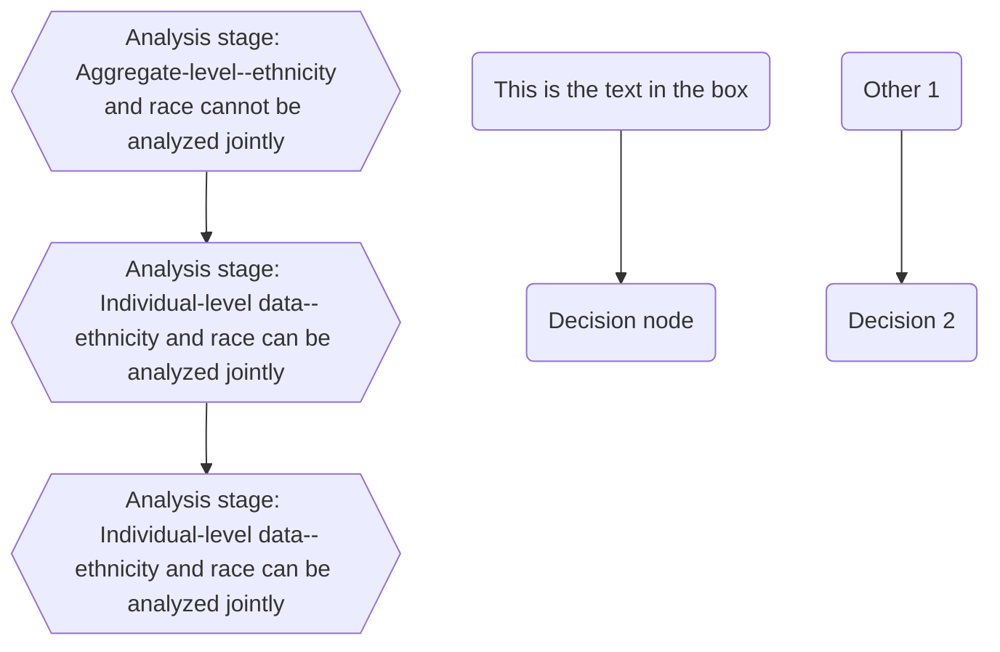
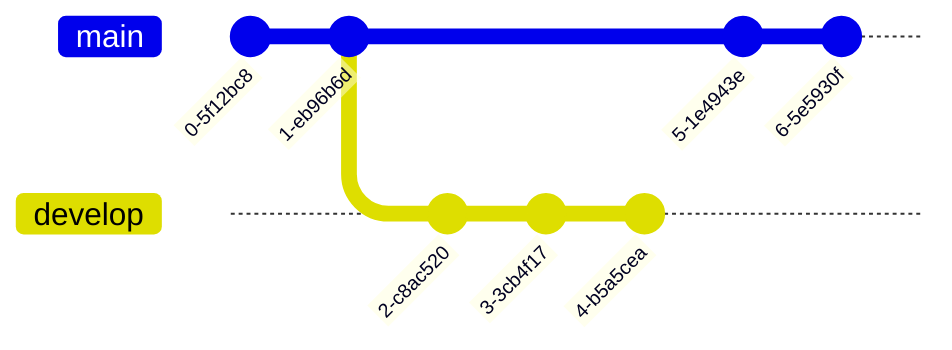
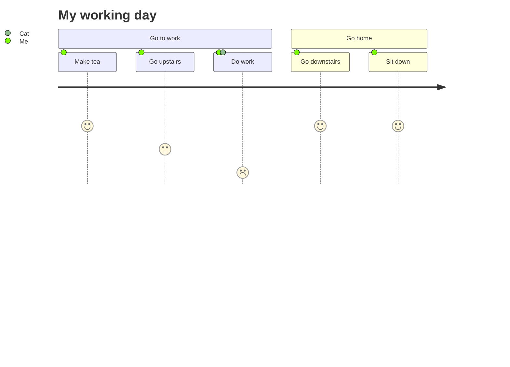

## Mermaid documentation

> [link](https://mermaid-js.github.io/mermaid/#/)

 

```mermaid
graph TD  
    id1{{Analysis stage: <br> Aggregate-level--ethnicity and race cannot be analyzed jointly}}-->id2{{Analysis stage: <br> Individual-level data--ethnicity and race can be analyzed jointly}};
    id2{{Analysis stage: <br> Individual-level data--ethnicity and race can be analyzed jointly}}-->id3{{Analysis stage: <br> Individual-level data--ethnicity and race can be analyzed jointly}}
    
    id6(This is the text in the box)-->id7(Decision node);
    
    id8(Other 1)-->id9(Decision 2);


```

 

```mermaid
 gitGraph
       commit
       commit
       branch develop
       commit
       commit
       commit
       checkout main
       commit
       commit
```

 

```mermaid
journey
    title My working day
    section Go to work
      Make tea: 5: Me
      Go upstairs: 3: Me
      Do work: 1: Me, Cat
    section Go home
      Go downstairs: 5: Me
      Sit down: 5: Me
```
