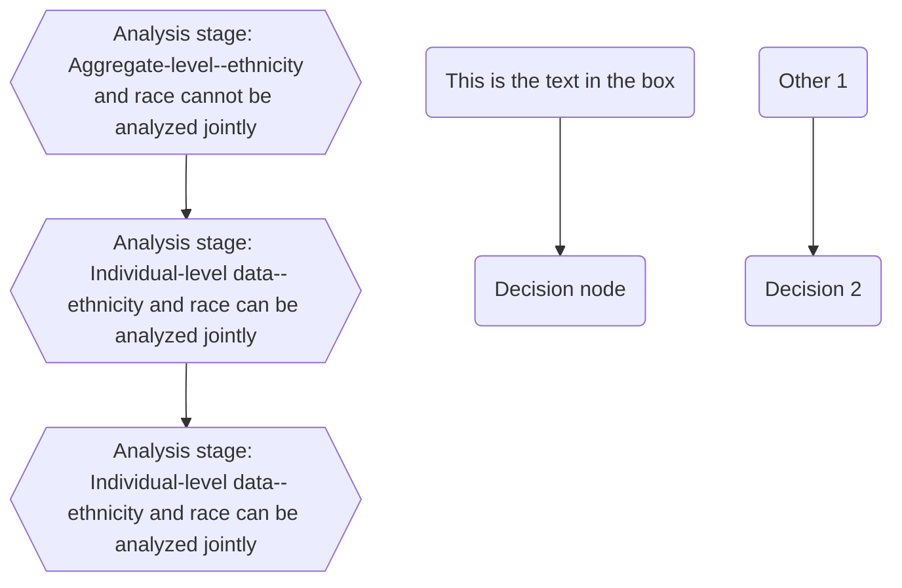

```mermaid
graph TD  
    id1{{Analysis stage: <br> Aggregate-level--ethnicity and race cannot be analyzed jointly}}-->id2{{Analysis stage: <br> Individual-level data--ethnicity and race can be analyzed jointly}};
    id2{{Analysis stage: <br> Individual-level data--ethnicity and race can be analyzed jointly}}-->id3{{Analysis stage: <br> Individual-level data--ethnicity and race can be analyzed jointly}}
    
    id6(This is the text in the box)-->id7(Decision node);
    
    id8(Other 1)-->id9(Decision 2);
```  
