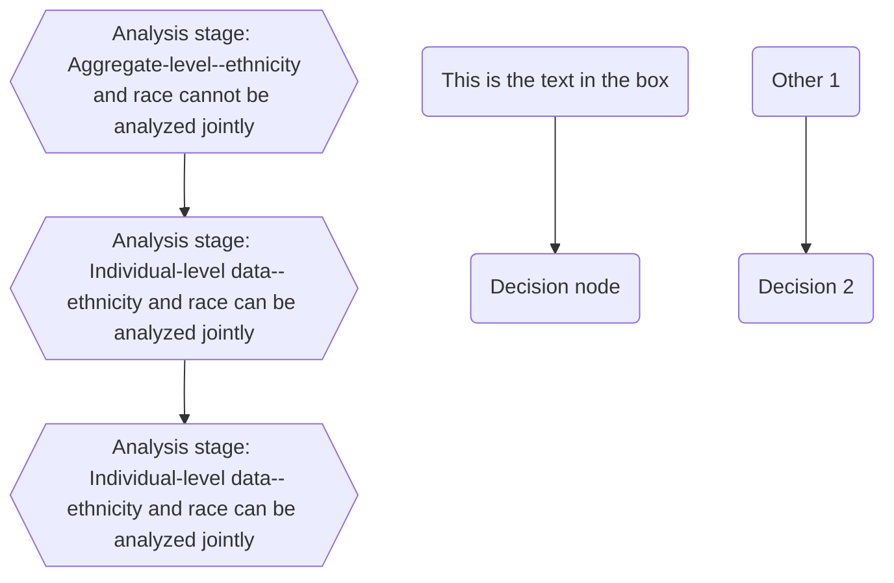
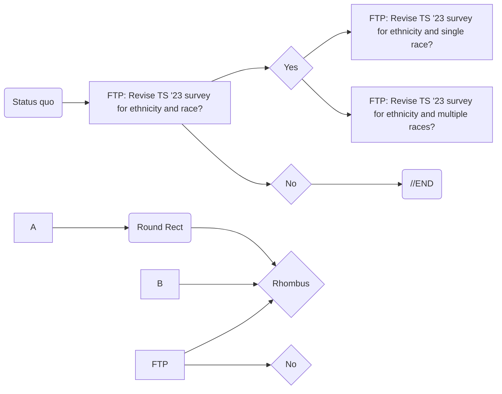
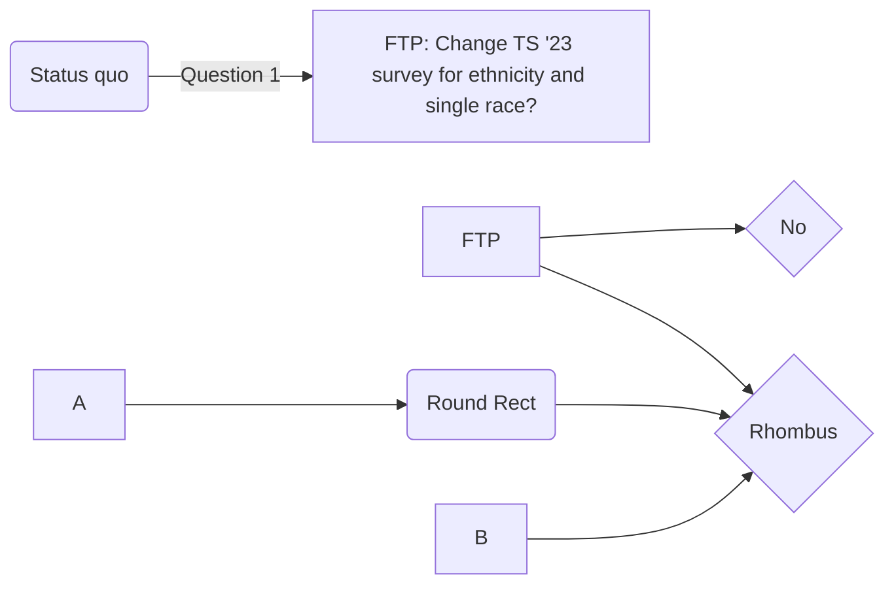

```mermaid
graph TD  
    id1{{Analysis stage: <br> Aggregate-level--ethnicity and race cannot be analyzed jointly}}-->id2{{Analysis stage: <br> Individual-level data--ethnicity and race can be analyzed jointly}};
    id2{{Analysis stage: <br> Individual-level data--ethnicity and race can be analyzed jointly}}-->id3{{Analysis stage: <br> Individual-level data--ethnicity and race can be analyzed jointly}}
    
    id6(This is the text in the box)-->id7(Decision node);
    
    id8(Other 1)-->id9(Decision 2);
```  

 

```mermaid
graph LR
%% VERSION 1
%% variables
%% SQ<n> - Status quo
%% FTP<n> - FTP
%% FEC<n> - FEC
%% Y<n> - Yes
%% N<n> - No
%% O<n> - Outcome
    SQ1(Status quo) --> FTP1[FTP: Revise TS '23 survey for ethnicity and race?]
    FTP1 --> Y1{Yes}
    FTP1 --> N1{No} 
    N1 --> O1(//END)
    Y1 --> FTP2[FTP: Revise TS '23 survey for ethnicity and single race?]
    Y1 --> FTP3[FTP: Revise TS '23 survey for ethnicity and multiple races?]

    
    FTP --> D{Yes}
    FTP --> E{No}
    A --> C(Round Rect)
    B --> D{Rhombus}
    C --> D
```  

 

```mermaid
graph LR
%% VERSION 2
%% A1 - status quo
%% B1 - FTP: Change TS '23 survey for ethnicity and single race?
%% B2 - FTP: C
%% D -
%% E -
%% F -
%% G -
%% H -
    A1(Status quo) -- Question 1 --> B1[FTP: Change TS '23 survey for ethnicity and single race?]
    FTP --> D{Yes}
    FTP --> E{No}
    A --> C(Round Rect)
    B --> D{Rhombus}
    C --> D
```  
